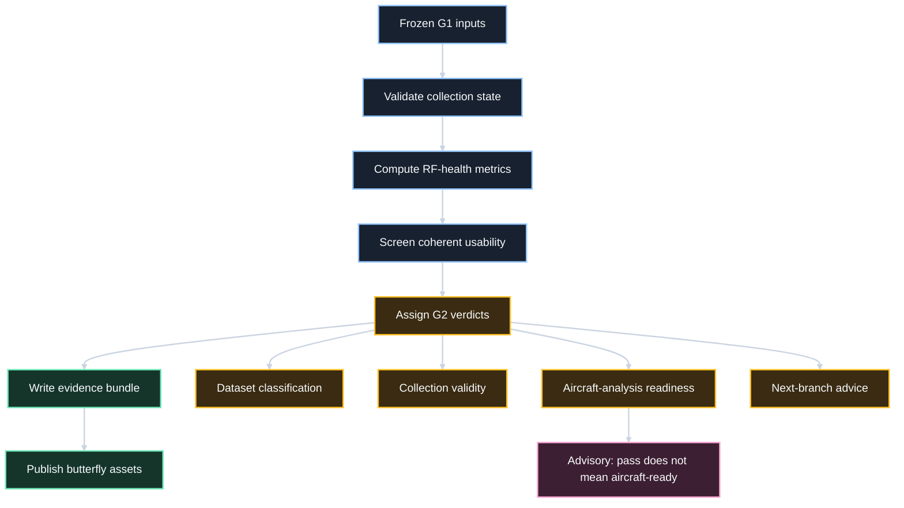

# G2 RF Health Butterfly

This Markdown file is the source of truth for the G2 RF-health butterfly communication assets. It summarizes the flow of collection checks, gate decisions, evidence outputs, and downstream readiness guidance for customer-facing and internal overview material.

## Mermaid Flowchart

## Overview
- Purpose: show how G2 turns frozen G1 ingest into RF-health evidence, collection-validity evidence, and aircraft-analysis readiness guidance.
- Scope: scored G2 content stays inside `RFH-001`, `RFH-002`, and `RFH-003`; downstream readiness signals remain advisory.

## Left Wing
- Frozen G1 inputs: `20260622T102123`, `[6144000 x 2]`, `RecordingUTC` anchors, intra-file CPI only.
- Collection-time validation: SDR state, gains, clocks, channel mapping, control captures, and operator checklist.
- Core RF-health checks: power, clipping, DC, IQ image risk, occupancy, spurs, and direct-path usability.
- CPI and dynamic-range screen: coherence pass fraction, lag stability, frequency drift, and usable surveillance headroom.

## Center
- G2 RF Health gate: evaluate `RFH-001`, `RFH-002`, and `RFH-003` on the frozen ingest contract.
- Legal outcomes: `pass`, `retune`, `reject`.
- Local rule: worst-case repetition or CPI behavior overrides friendly averages.

## Right Wing
- Dataset classification: `golden`, `diagnostic`, `rejected`.
- Collection validity: `hardware_configuration_validated`, `hardware_state_partially_evidenced`, `hardware_state_not_established`.
- Aircraft-analysis readiness: `fit_for_later_aircraft_related_analysis`, `diagnostic_use_only`, `insufficient_evidence`.
- Next-branch advice: `ProceedToG3_WithCaveats`, `HoldForCollectionValidation`, `RecollectBeforeAircraftClaims`.

## Flow Steps
- 1. Frozen G1 inputs: load the approved session data and manifest-driven metadata.
- 2. Validate collection state: confirm hardware settings, clocking, gains, mapping, and control captures.
- 3. Compute RF-health metrics: evaluate per-repetition and worst-case channel and spectral metrics.
- 4. Evaluate coherent usability: screen CPI stability, frequency drift, and usable surveillance dynamic range.
- 5. Assign verdicts: set the legal gate outcome, dataset classification, collection-validity verdict, and aircraft-analysis readiness verdict.
- 6. Write evidence bundle: emit the standard files, G2 notes, and the required figures.
- 7. Publish communication assets: regenerate the G2 butterfly PNG and editable PowerPoint.

## Evidence Outputs
- Bundle root: `artifacts/<datasetId>/G2_RF_Health/<runTimestampZ>/` with `summary.md`, `requirements_coverage.csv`, `config_snapshot.json`, `metrics.json`, `metrics.mat`, `decision.txt`, `failure_cause.txt`, and `next_branch.txt`.
- G2-specific files: `dataset_classification_note.md`, `receiver_state_table.csv`, `collection_validity_note.md`, and figures `01` through `08`.
- Communication assets: `artifacts/communication/G2_RF_Health/G2_RF_Health_Butterfly.png` and `artifacts/communication/G2_RF_Health/G2_RF_Health_Butterfly.pptx`.

## Visual Notes
- Downstream G3, G4, G5, and G7 readiness is shown as advisory context, not as G2 scoring logic.
- A legal G2 `pass` does not automatically mean the dataset is fit for later aircraft-related analysis.
- Missing collection-state evidence downgrades collection-validity and aircraft-analysis readiness even when RF plots look clean.
