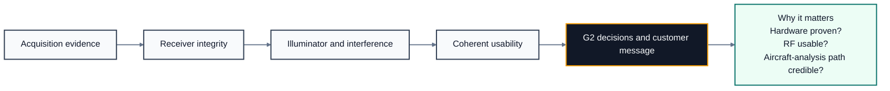

# G2 RF Health Customer Flow

This Markdown file is the source of truth for the customer-facing G2 RF-health communication assets. It explains the questions G2 asks, the planned MATLAB code path used to quantify them, and the decision logic that matters when communicating whether a collection is ready for later passive-bistatic work.

## Mermaid Flowchart

## Overview
- Purpose: explain the customer-facing WHY, HOW, and decision logic for G2 RF health.
- Planned code path: `loadIQData` provides the frozen G1 input and `runG2RFHealth` will orchestrate the native MATLAB checks and evidence bundle.
- Customer meaning: G2 tells us whether the collection setup was proven, whether the RF scene is usable, and whether the dataset has a credible path to later aircraft-related analysis.

## Stage 1 - Acquisition Evidence
- Questions: Was the receiver configuration and hardware state validated at collection time; are the declared reference and surveillance roles and physical channel mappings proven.
- MATLAB path: metadata presence audit in MATLAB tables and JSON snapshots; `pwelch`, `mscohere`, and `xcorr` for role and consistency evidence.
- Expected criteria: Missing setup evidence downgrades collection-validity and aircraft-readiness verdicts; mapping ambiguity keeps the dataset `diagnostic` and holds downstream aircraft claims.
- Why it matters: Separates hardware and setup uncertainty from true RF-scene limitations.

## Stage 2 - Receiver Integrity
- Questions: Is the reference channel stronger and cleaner than surveillance; are either channels clipping or quantization-limited; is DC or LO leakage material; is IQ imbalance or image energy material.
- MATLAB path: vectorized sample statistics; `pwelch`; `bandpower`; `iqimbal2coef`.
- Expected criteria: Severe clipping or hard RF failure drives `reject`; moderate DC or IQ contamination drives `retune` or `diagnostic`.
- Why it matters: Protects downstream sync and passive-map work from front-end artifacts.

## Stage 3 - Illuminator and Interference
- Questions: Is the illuminator band present, occupied, and stable across repetitions; are narrowband spurs, impulsive bursts, or unexpected interferers dominating the band.
- MATLAB path: `obw`; `bandpower`; `pwelch`; `spectrogram`; `islocalmax`.
- Expected criteria: Weak or unstable illuminator content downgrades to `diagnostic`; dominant interference can drive `reject`.
- Why it matters: Confirms there is a usable transmitter of opportunity rather than just energy in the band.

## Stage 4 - Coherent Usability
- Questions: Is usable direct-path energy present in surveillance; are candidate CPI windows coherently usable and stationary enough; is there enough usable dynamic range and local separation to give a credible shot at aircraft-related signatures.
- MATLAB path: `xcorr`; `finddelay`; `mscohere`; `ambgfun` preview; CPI pass-fraction metrics.
- Expected criteria: Weak direct-path stability or low CPI pass fraction yields `diagnostic` and aircraft-readiness downgrade; persistent coherent failure blocks justified downstream opening.
- Why it matters: Distinguishes RF-clean data from data that is coherent enough for later passive processing.

## Stage 5 - Session Classification and Decision
- Questions: Are impairments isolated or systemic across the session; do we have enough acquisition metadata to explain RF-health results later; what legal and advisory verdicts should be carried forward.
- MATLAB path: worst-case repetition and CPI summaries in MATLAB tables; `tiledlayout` trend figures; JSON snapshot audit; decision-traceability table.
- Expected criteria: Worst-case repetition or CPI behavior overrides friendly averages; `golden` requires healthy margin; `diagnostic` carries caveats; `rejected` stops the path.
- Why it matters: Creates a defensible gate decision instead of a plot-driven opinion.

## Outputs
- Legal gate output: `pass`, `retune`, or `reject`.
- Classification output: `golden`, `diagnostic`, or `rejected`.
- Collection-validity output: `hardware_configuration_validated`, `hardware_state_partially_evidenced`, or `hardware_state_not_established`.
- Aircraft-readiness output: `fit_for_later_aircraft_related_analysis`, `diagnostic_use_only`, or `insufficient_evidence`.
- Communication message: tells the customer whether the hardware was proven, whether the RF scene was usable, and whether the dataset has a credible path to later aircraft-related analysis.

## Visual Notes
- G2 does not claim later gates are complete; it establishes whether later work is technically justified.
- A legal G2 `pass` does not automatically mean aircraft-related analysis is justified.
- Missing evidence is reported separately from bad RF performance so the root cause remains interpretable.
- Numeric cut points are intentionally not shown in this customer asset until they are frozen in code and evidence.
