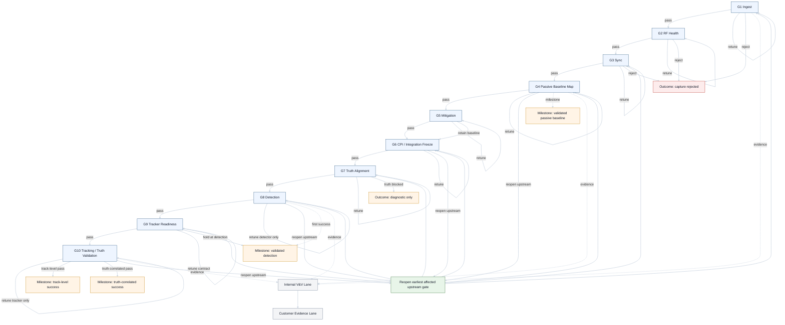

# Pipeline Flowchart

Documentation scope only. This Mermaid source defines the approved planning flow for later implementation and does not create executable pipeline logic in this pass.

Expert roles: passive bistatic radar algorithm expert, RF/data-quality expert, signal processing and detection QE expert, requirements and V&V expert, MATLAB test architecture expert, tracking metrics/V&V expert, and systems/customer-communication review inputs.

## PowerPoint Generation

- Source of truth: this Markdown file
- Generator: `generatePipelineFlowchartPpt.m`
- Output artifact: `artifacts/ppt/PipelineFlowchart.pptx`
- Platform note: the generator uses MATLAB with Microsoft PowerPoint COM automation on Windows so the slide remains editable

## Preview-Safe Diagram

## Gate Summary

| Gate | Purpose | Key MATLAB method | Acceptance metric family | Evidence artifact |
| :--- | :--- | :--- | :--- | :--- |
| `G1 Ingest` | Manifest, decode, timing, and CPI contract | `jsondecode`, native baseband reader or `fread` fallback | Inventory reconciliation, seam continuity, decode consistency | Manifest table, seam summary, decode note |
| `G2 RF Health` | Channel quality and dataset classification | `pwelch` plus signal-quality metrics | RMS, PAR, clipping, DC, IQ imbalance, direct-path prominence | RF table, PSD plots, classification note |
| `G3 Sync` | Lag and residual frequency model | Correlation and coherence analysis | Lag stability, residual offset stability, CPI sensitivity | Lag stats, offset stats, sensitivity summary |
| `G4 Passive Baseline Map` | Trusted passive-map oracle | `ambgfun` | Axis plausibility, direct-path plausibility, repeatability | Baseline maps, repeatability summary |
| `G5 Mitigation` | Compare no mitigation and LMS baselines | `dsp.LMSFilter` candidate | Clutter suppression, protected-energy retention, downstream detectability | Before/after clutter metrics |
| `G6 CPI / Integration Freeze` | Freeze detector input product | CPI and integration comparisons | Integration gain, peak smearing, repeatability | Frozen config record, gain summary |
| `G7 Truth Alignment` | Radar-to-truth timing contract | Manifest and embedded-header time conversion | Overlap quality, timing residuals, validation-window quality | Overlap tables, timing residuals |
| `G8 Detection` | Validated CFAR on frozen products | `phased.CFARDetector2D` | False-alarm density, hit rate, persistence | Detection table, false-alarm summary |
| `G9 Tracker Readiness` | Decide if detections can feed `trackerGNN` | Measurement-schema validation | Continuity, fragmentation risk, schema completeness | Continuity summary, schema note |
| `G10 Tracking / Truth Validation` | Batch track-to-truth evaluation | `trackerGNN`, `trackAssignmentMetrics`, `trackErrorMetrics` | Assignment quality, continuity, coast, initiation delay, error | Track metrics, assignment history, milestone note |

## Decision Logic

- `pass`: move to the next gate.
- `retune`: stay inside the current gate's parameter space.
- `reject`: stop at `capture rejected`.
- `reopen upstream`: reopen the earliest affected upstream gate when a contract changes.
- `truth blocked`: remain `diagnostic only`.
- `first success`: `validated detection` is the first success milestone that unlocks tracking work.
